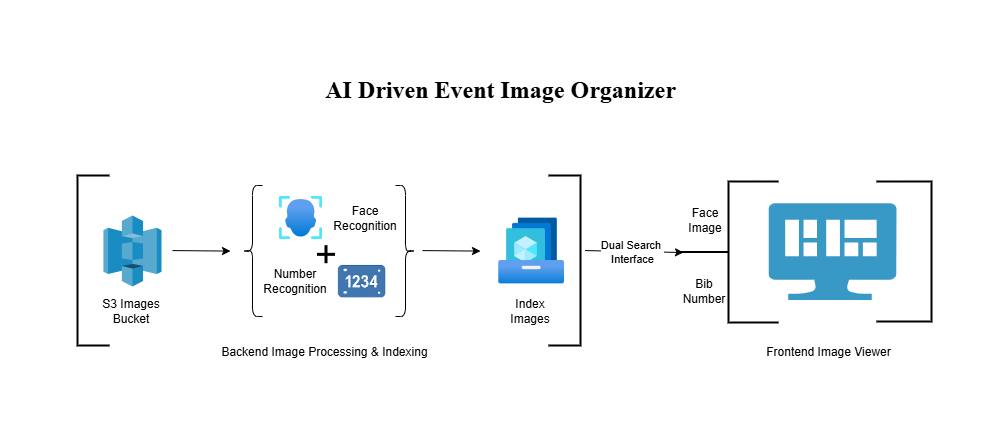

# 🏃 AI-Driven Event Image Organizer

An AI-powered backend system that automatically organizes and indexes large sets of event photos (such as marathon or sports events) using face recognition and bib number detection. It enables participants to easily retrieve their personal images either by uploading a photo or entering their bib number.

---

## 📌 Overview

**AI-Driven Event Image Organizer** automates the manual task of sorting and tagging thousands of photos taken during an event. By using face recognition and a bib number detection model, it groups photos by individual participants and indexes them for fast retrieval.

> ⚠️ This repository contains only the README and architectural flow for understanding the system design. No datasets, models, or code are included due to company restrictions.

---

## 🔁 Key Features

- 🧠 **Face Recognition** – Detects and clusters images of the same individual
- 🔢 **Bib Number Detection** – Identifies runner numbers from bibs using object detection
- 🗂️ **Automatic Indexing** – Groups images based on face and bib number for search
- 🔍 **Dual Search Interface** – Users can find their images by uploading a face or entering a bib number
- ⬇️ **Download Selection** – Users can select and download their personal images

---

## 🧠 Architecture



---

## 🛠 Tech Stack

| Component            | Tool/Service                          |
|---------------------|----------------------------------------|
| Language             | Python                                |
| Face Recognition     | Dlib / DeepFace / face_recognition     |
| Object Detection     | YOLO / SSD / Custom CNN (for Bib detection)  |
| Image Processing     | OpenCV                                |
| OCR (optional)       | Tesseract / EasyOCR                   |
| Frontend (optional)  | HTML/JS or lightweight framework       |
| Storage              | Local / S3 / Cloud bucket              |

---

## 🎯 Objective

To automate the process of organizing and delivering participant-specific photos for large-scale sports events by detecting faces and bib numbers using AI.

---

## 🔄 Pipeline Overview

1. **📸 Image Collection**  
   All raw photos from the event are uploaded to a central repository.

2. **🧠 Face Recognition**  
   Each image is analyzed for faces. Images with the same individual are grouped together.

3. **🔢 Bib Number Recognition**  
   A trained object detection model scans for bibs and extracts the visible number.

4. **🗂 Image Indexing**  
   Images are indexed and tagged based on face and bib number matches.

5. **🧑‍💻 User Retrieval**  
   On the frontend, users can:
   - Upload their face to get matched images
   - Enter their bib number to view all relevant images

6. **⬇️ Image Selection & Download**  
   Users can select and download images individually or in bulk.

---

## 📥 Example Output (JSON - Internal)

```json
{
  "person_id": "face_cluster_27",
  "bib_number": "1456",
  "matched_images": [
    "img_0456.jpg",
    "img_0521.jpg",
    "img_0590.jpg"
  ]
}
```

---

## 🧾 Use Cases

- ✅ **Marathon & Running Events**  
  Automatically deliver participant-specific race photos using face and bib number recognition.

- ✅ **Sports Tournaments**  
  Group and retrieve athlete images based on facial clustering or jersey/bib numbers.

- ✅ **Photography Platforms**  
  Help photographers tag, index, and offer personalized photo downloads to clients.

- ✅ **School/College Events**  
  Organize large batches of student photos by face for yearbooks or digital galleries.

- ✅ **Corporate Events**  
  Provide personalized image access after conferences, marathons, or team-building events.


---

## 🔒 Disclaimer

This repository demonstrates a professional-grade application structure and processing pipeline.  
It **does not include** proprietary data, production-trained models, or confidential credentials. 
You are free to adapt the structure, pipeline logic, and modular components for educational, testing, or private deployments.

---

## 👨‍💻 Author

**Goutham Sidhik**  
AI/ML Engineer | Computer Vision & GenAI Developer  
[LinkedIn](https://www.linkedin.com/in/goutham-sidhik-amuluru-50231b163/)

---
